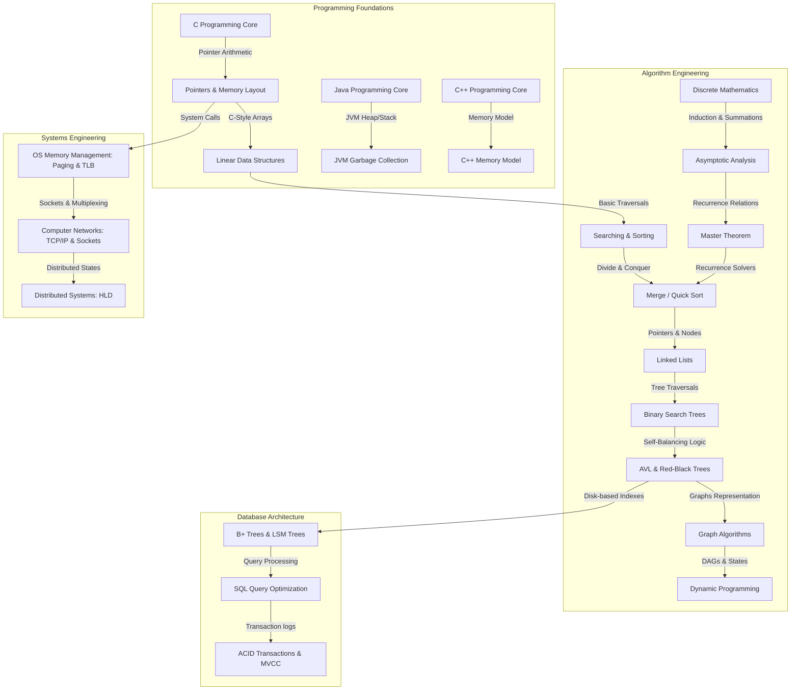

# 📊 Subject Dependency Graph

To learn without gaps, follow the topological sorting of concepts shown below. A solid line ($A \rightarrow B$) indicates that concept $A$ is a prerequisite for concept $B$.

---

---

## 🛠️ Recommended Study Paths

### 1. The Algorithmist Path
`Discrete Mathematics` $\rightarrow$ `Asymptotic Analysis` $\rightarrow$ `Master Theorem` $\rightarrow$ `Self-Balancing Trees` $\rightarrow$ `Graph Algorithms` $\rightarrow$ `Dynamic Programming`.

### 2. The Systems Architect Path
`C/C++` $\rightarrow$ `Pointers` $\rightarrow$ `OS Memory Management` $\rightarrow$ `B+ Trees` $\rightarrow$ `TCP/IP Networks` $\rightarrow$ `Distributed Systems & CAP Theorem`.
