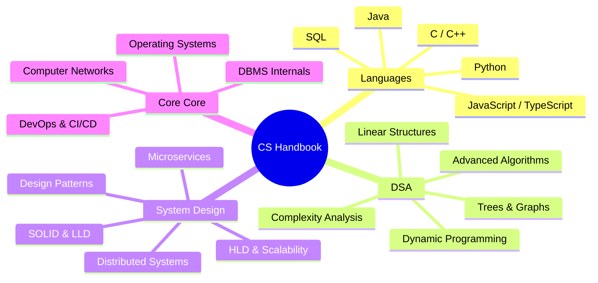

# 🚀 The Ultimate Computer Science Knowledge Repository

Welcome to the most comprehensive, textbook-grade Computer Science handbook ever written. This repository is designed to take you from an absolute beginner to an expert-level engineer capable of cracking elite technology companies (Google, Meta, Apple, Netflix, Nvidia, OpenAI, etc.).

---

## 🗺️ Master Navigation & Learning Systems

Use these core documents to guide your multi-year self-study curriculum:

| Document | Purpose | Target Timeline |
| :--- | :--- | :--- |
| 📅 **[Schedules](file:///Users/bharathkumar/Desktop/PlacementAI-main/cs-handbook/SCHEDULES.md)** | Daily/weekly study plans | 3-Month / 6-Month / 1-Year / 2-Year |
| 🗺️ **[Roadmaps](file:///Users/bharathkumar/Desktop/PlacementAI-main/cs-handbook/ROADMAPS.md)** | Step-by-step roadmap by role | Frontend, Backend, Systems, AI/ML |
| 📊 **[Dependency Graph](file:///Users/bharathkumar/Desktop/PlacementAI-main/cs-handbook/DEPENDENCY_GRAPH.md)** | Topological sequence of concepts | Learn in order without gaps |

---

## 🧠 Mind Map of Domain Curriculums



---

## 🏛️ Comprehensive Catalog

### 1. Programming Languages (`/languages/`)
Deep mechanics, compilers, memory layouts, and functional programming.

| Language | Beginner | Intermediate | Expert / Systems |
| :--- | :--- | :--- | :--- |
| **Java** | Syntax, OOP, Arrays | Collections, Exception Handling | [Java Memory Model](file:///Users/bharathkumar/Desktop/PlacementAI-main/cs-handbook/languages/java-cpp-memory-models.md), GC Internals, Multithreading |
| **C++** | Variables, Control Flow | Pointers, STL, Structs | [C++ Memory Model](file:///Users/bharathkumar/Desktop/PlacementAI-main/cs-handbook/languages/java-cpp-memory-models.md), Templates, Memory Allocation |
| **Python** | Data Types, Loops | Decorators, Iterators, Modules | GIL, Memory Management, Asyncio |
| **TypeScript** | Types, Interfaces | Generic Constraints, Decorators | Advanced Utility Types, TS Compiler Internals |
| **SQL** | Queries, Filters | Joins, Subqueries | Indexing Mechanics, Normalization, Query Tuning |

---

### 2. Data Structures & Algorithms (`/dsa/`)
A rigorous, proof-oriented DSA sequence.

```
Beginner ──────> Intermediate ──────> Advanced ──────> Expert
(Arrays/LL)     (BSTs/Heaps)        (DP/Graphs)       (Segment Trees/Flows)
```

* **Complexity Analysis**:
  * Asymptotic Analysis (Big O, Big Omega, Big Theta)
  * [Master Theorem Proof & Applications](file:///Users/bharathkumar/Desktop/PlacementAI-main/cs-handbook/dsa/complexity-analysis/master-theorem.md)
* **Linear Structures**: Arrays, Strings, Linked Lists, Stacks, Queues
* **Trees & Advanced Hierarchies**: BSTs, AVL Trees, Red-Black Trees, Segment Trees, Trie, Heaps
* **Dynamic Programming**: Memoization vs Tabulation, Multi-dimensional DP, Bitmask DP
* **Graph Algorithms**: BFS/DFS, Dijkstra, Bellman-Ford, Kruskal, Prim, Network Flow

---

### 3. System Design (`/system-design/`)
Architecting planetary-scale distributed systems.

* **Low-Level Design (LLD)**:
  * SOLID Principles Cheat Sheet
  * Design Patterns (Creational, Structural, Behavioral)
  * UML diagrams, Class and Sequence diagrams
* **High-Level Design (HLD)**:
  * Load Balancing, CDNs, and Caching (Redis/Memcached)
  * Distributed Messengers (Kafka, RabbitMQ)
  * [CAP Theorem & Trade-offs](file:///Users/bharathkumar/Desktop/PlacementAI-main/cs-handbook/system-design/hld/cap-theorem.md)
  * Distributed Sharding, Replication, and Partitioning

---

### 4. Database Internals (`/databases/`)
* ACID Transactions and Concurrency Control (MVCC)
* Indexes: B+ Trees vs LSM Trees vs Hash Indexes
* Execution Plans, Normalization Forms, and Query Optimization

---

### 5. Systems & Networks (`/operating-systems/` & `/computer-networks/`)
* **Operating Systems**:
  * Processes, Virtual Threads, Scheduling (CPU)
  * Virtual Memory, Paging, TLB, Page Faults
  * Deadlock Avoidance (Banker's Algorithm), Thread Sync Mutexes
* **Computer Networks**:
  * OSI Model vs TCP/IP Stack
  * HTTP/3, HTTPS, TLS Handshake, DNS Resolution
  * Sockets, WebSockets, gRPC, and REST

---

## 💡 Quick Tips for Core Interviews

> [!TIP]
> **Google Pattern**: Focus heavily on Graphs, Dynamic Programming, and Low-Level Memory details.
> **Amazon Pattern**: Focus heavily on System Design (LLD/HLD) and Leadership Principles.
> **Meta Pattern**: Focus on fast execution, Sliding Window, Two Pointers, and Binary Trees.
