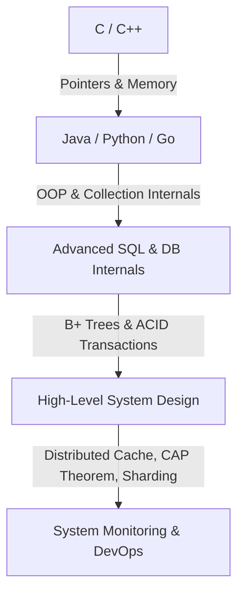
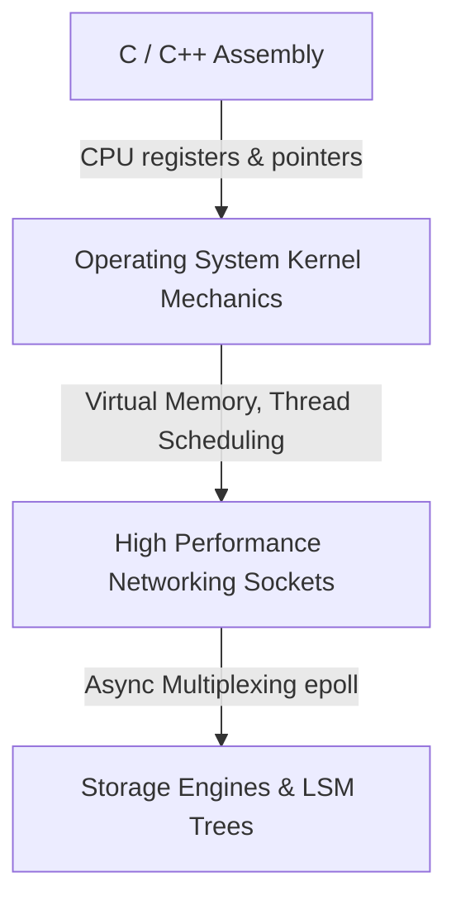
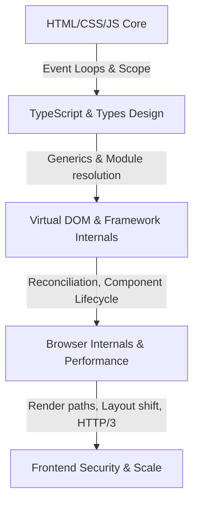
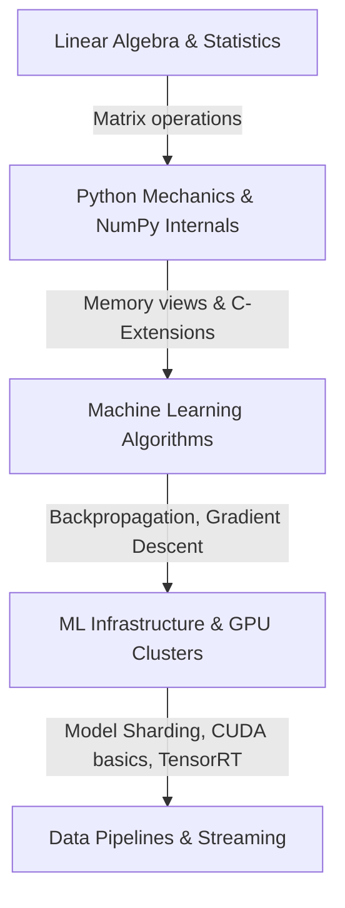

# 🗺️ Career & Concept Roadmaps

This page outlines learning roadmaps for four major software engineering career tracks. Follow the concepts in chronological order to build expert competencies.

---

## 1. Backend Systems Engineer

### Milestone Timeline (Backend)
1. **Month 1-3**: Master OOP, runtime memory execution, and JVM/C++ memory models.
2. **Month 4-6**: Learn advanced database operations, transactions (ACID), B+ Tree indexes, and Normalization.
3. **Month 7-9**: Distributed architectures, microservices, REST vs gRPC, caching strategies, and CAP theorem trade-offs.

---

## 2. Systems & Low-Level Engineer (Linux Kernel, Databases, compilers)

### Milestone Timeline (Systems)
1. **Month 1-4**: Deep dive into raw C, pointer arithmetic, structure alignment, memory padding, and compilation pipeline.
2. **Month 5-8**: Operating System mechanics: scheduler policies, page allocation, kernel threads, custom mutex implementations, and signal handling.
3. **Month 9-12**: Building storage engines (LSM/B+ Trees) and high-performance network programming using socket APIs (`epoll`/`kqueue`).

---

## 3. High-Performance Front-end Architect

### Milestone Timeline (Frontend)
1. **Month 1-2**: Browser rendering engine paths, JS Event Loops, V8 engine engine optimizations.
2. **Month 3-4**: TypeScript type systems (Conditional types, templates, generic mappings).
3. **Month 5-8**: Next.js internals, Server-Side Rendering (SSR) pipeline, edge runtimes, bundle optimizations.

---

## 4. AI & Machine Learning Infrastructure Engineer

### Milestone Timeline (ML Infra)
1. **Month 1-3**: Calculus, linear algebra, vectorization, PyTorch tensors, autograd mechanics.
2. **Month 4-6**: GPU hardware architectures, CUDA cores, kernel latency, memory paging bottlenecks.
3. **Month 7-12**: Model serving clusters, model sharding techniques, Pipeline Parallelism, TensorRT optimizations.
