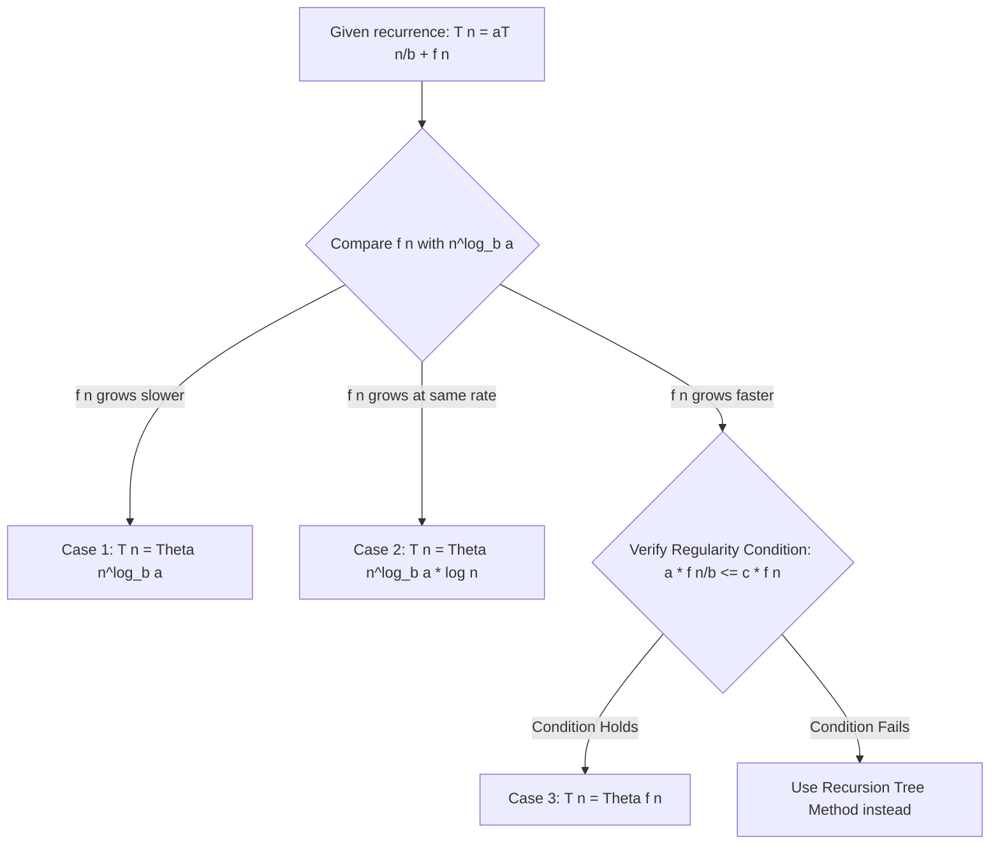

# 📐 The Master Theorem for Recurrences

This module covers the mathematical framework and proof structures for solving divide-and-conquer recurrence relations.

---

## 1. Quick Revision Box & Memory Tricks

> [!NOTE]
> * **Standard Form**: $T(n) = aT(n/b) + f(n)$ where $a \geq 1$ and $b > 1$.
> * **Critical Value**: $c_{crit} = \log_b(a)$.
> * **Comparison Rule**:
>   * If $f(n) = O(n^c)$ where $c < c_{crit}$: $T(n) = \Theta(n^{\log_b a})$ (Case 1: Leaves dominate)
>   * If $f(n) = \Theta(n^{c_{crit}} \log^k n)$: $T(n) = \Theta(n^{\log_b a} \log^{k+1} n)$ (Case 2: Balanced cost)
>   * If $f(n) = \Omega(n^c)$ where $c > c_{crit}$ and regularity holds: $T(n) = \Theta(f(n))$ (Case 3: Root dominates)

---

## 2. Intuition
When solving divide-and-conquer algorithms, we split a problem into $a$ subproblems of size $n/b$, doing $f(n)$ non-recursive work. The total runtime depends on the tension between the recursive branching cost (base cases/leaves) and the root-level partition cost.

```
                  Root [f(n)]                    <--- Root Dominance
                 /     |     \
          T(n/b)     T(n/b)   T(n/b)
         /   |   \
      ...   ...   ...
    [ n^log_b(a) leaves ]                         <--- Leaf Dominance
```

---

## 3. Classification Decision Tree



---

## 4. Multi-Language Complexity Simulations

Here are code simulations validating the execution time complexity limits for Merge Sort and Binary Search.

### Java: Simulation of Merge Sort Complexities
```java
public class MergeSortRecurrenceSim {
    // T(n) = 2T(n/2) + O(n) -> Theta(n log n)
    public static void mergeSortSim(int n) {
        if (n <= 1) return;
        
        // Split step: a=2 subproblems of size n/2
        mergeSortSim(n / 2);
        mergeSortSim(n / 2);
        
        // Merge step: O(n) linear scanning work
        for (int i = 0; i < n; i++) {
            // simulating merging logic
        }
    }
}
```

### C++: Simulation of Binary Search Complexities
```cpp
// T(n) = T(n/2) + O(1) -> Theta(log n)
void binarySearchSim(int n) {
    if (n <= 1) return;
    
    // Split step: a=1 subproblem of size n/2
    binarySearchSim(n / 2);
    
    // Pivot selection: O(1) work
    int pivotWork = 0 + 1; 
}
```

---

## 5. Summary of Standard Cases

| Recurrence Relation | $a$ | $b$ | $f(n)$ | $\log_b a$ | Case | Big-O Complexity |
| :--- | :--- | :--- | :--- | :--- | :--- | :--- |
| **Binary Search** | 1 | 2 | $1$ | 0 | Case 2 ($k=0$) | $O(\log n)$ |
| **Merge Sort** | 2 | 2 | $n$ | 1 | Case 2 ($k=0$) | $O(n \log n)$ |
| **Matrix Mult (Strassen)** | 7 | 2 | $n^2$ | 2.81 | Case 1 | $O(n^{2.81})$ |
| **Fast Fourier Transform** | 2 | 2 | $n \log n$ | 1 | Case 2 ($k=1$) | $O(n \log^2 n)$ |

---

## 6. Edge Cases & Advanced Generalizations

### 1. Fractional Subproblem Sizes
The Master Theorem does not directly handle recurrences like $T(n) = T(n/3) + T(2n/3) + n$.
* **Solution**: Use the **Akra-Bazzi method** or draw a recursion tree.

### 2. Failure of Regularity Condition
For Case 3, we must verify $a \cdot f(n/b) \leq c \cdot f(n)$ for some $c < 1$.
* Example: $T(n) = 2T(n/2) + n \sin n$.
* Here, the trigonometric oscillation violates the regularity condition. The Master Theorem is inapplicable.

---

## 7. Curated Practice Problems
1. **Recurrence**: $T(n) = 8T(n/2) + n^2$ $\rightarrow$ Case 1 $\rightarrow$ $T(n) = \Theta(n^3)$.
2. **Recurrence**: $T(n) = 4T(n/2) + n^2 \log n$ $\rightarrow$ General Case 2 $\rightarrow$ $T(n) = \Theta(n^2 \log^2 n)$.
3. **Company Tags**: Google, Meta, Microsoft (asked in structural algorithm rounds).
