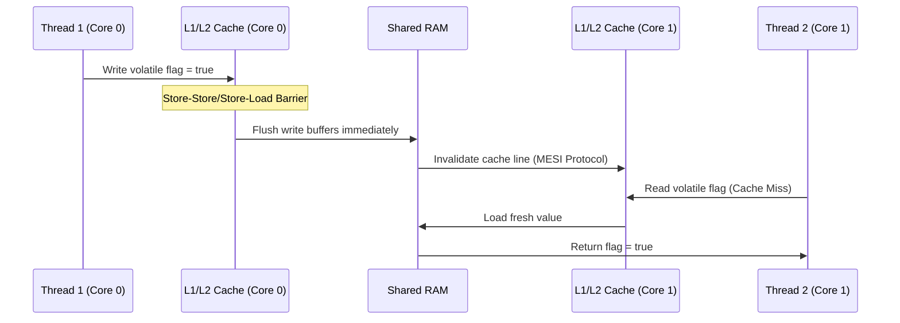

# 🧠 Programming Language Memory Models: Java vs. C++

This module explores runtime visibility, hardware cache coherence, volatile semantics, and raw assembly instructions across Java and C++.

---

## 1. Quick Revision Box & Memory Tricks

> [!NOTE]
> * **JMM (Java Memory Model)**: Dictates visibility guarantees via *Happens-Before* edges (e.g., volatile reads, monitor locks).
> * **C++ Memory Model**: Multi-copy atomicity and explicit memory orders (`memory_order_seq_cst`, `memory_order_acquire`, etc.).
> * **Memory Trick (Acquire-Release)**: 
>   * *Release* = "Push my writes down to memory." (Store-Store barrier)
>   * *Acquire* = "Pull latest writes from memory." (Load-Load barrier)

---

## 2. Intuition & Real-World Application
Modern CPUs do out-of-order execution and use multi-layered cache hierachies (L1, L2, L3). Without a memory model, writes made by Thread A on Core 0 may remain in write-buffers and never become visible to Thread B on Core 1.
* **Real-world Context**: Building lock-free queues (Disruptor pattern) or atomic reference counters.

---

## 3. Detailed Theory & Execution Flow

### Java Happens-Before Rules
The Java Memory Model is defined by a set of partial orderings called *Happens-Before* rules:
1. **Program Order Rule**: Each action in a thread happens-before any action in that thread that comes later in program order.
2. **Volatile Variable Rule**: A write to a volatile field happens-before every subsequent read of that same field.
3. **Monitor Lock Rule**: An unlock on a monitor happens-before every subsequent lock on that same monitor.

### Hardware Cache vs JVM Memory Visiblity



---

## 4. Code Implementation & Walkthrough

### Java Memory Model: Double-Checked Locking (Thread-Safe)
```java
public class SafeLazySingleton {
    // Volatile is mandatory here to prevent instruction reordering
    private static volatile SafeLazySingleton instance;

    public static SafeLazySingleton getInstance() {
        SafeLazySingleton result = instance;
        if (result == null) {
            synchronized (SafeLazySingleton.class) {
                result = instance;
                if (result == null) {
                    instance = result = new SafeLazySingleton();
                }
            }
        }
        return result;
    }
}
```

### C++ Memory Model: Acquire-Release Semantics
```cpp
#include <atomic>
#include <thread>
#include <cassert>

std::atomic<int> data{0};
std::atomic<bool> ready{false};

void producer() {
    data.store(42, std::memory_order_relaxed);
    // Release barrier guarantees write to 'data' is flushed first
    ready.store(true, std::memory_order_release); 
}

void consumer() {
    // Acquire barrier guarantees we read the updated 'data'
    while (!ready.load(std::memory_order_acquire));
    assert(data.load(std::memory_order_relaxed) == 42);
}
```

---

## 5. Comparison: Java vs. C++ Memory Operations

| Concept / Behavior | Java Memory Model | C++ Memory Model |
| :--- | :--- | :--- |
| **Default Variable Access** | Data races lead to undefined behavior or dirty reads | Data races cause full Undefined Behavior (UB) |
| **Sequential Consistency** | Default behavior for `volatile` variables | Default for `std::atomic` (`memory_order_seq_cst`) |
| **Fine-grained Control** | Limited (Unsafe/VarHandle) | Rich (`memory_order_relaxed`, `memory_order_acquire`, etc.) |
| **Hardware Fence Injections** | Done implicitly by JIT compiler | Done explicitly or via compiler intrinsics |

---

## 6. Edge Cases, Mistakes & Debugging

### Common Mistake: Missing Volatile in Double-Checked Locking
Without `volatile`, the compiler or CPU can reorder the constructor execution and the write to the reference pointer:
1. Allocate memory.
2. Publish pointer reference to `instance`.
3. Call constructor (reordered!).
Thread B reads the non-null reference before Step 3 completes and gets a partially-constructed object.

### Debugging lock-free codes:
* Use **ThreadSanitizer (TSan)** on C++ binaries to find memory races.
* Use **jcstress** on Java code to check concurrency anomalies.

---

## 7. Company Interview Patterns

* **Meta / Google**: Asking candidates to implement a lock-free queue or ring-buffer and explain memory orderings required for push/pop.
* **Target Questions**:
  1. What is the difference between `volatile` in Java and `volatile` in C/C++? (Crucial: C++ `volatile` is for memory-mapped I/O, not thread synchronization).
  2. Explain the CPU instructions generated by a volatile write in x86 vs ARM. (x86 is strongly-ordered; ARM is weakly-ordered and requires explicit fence instructions).
