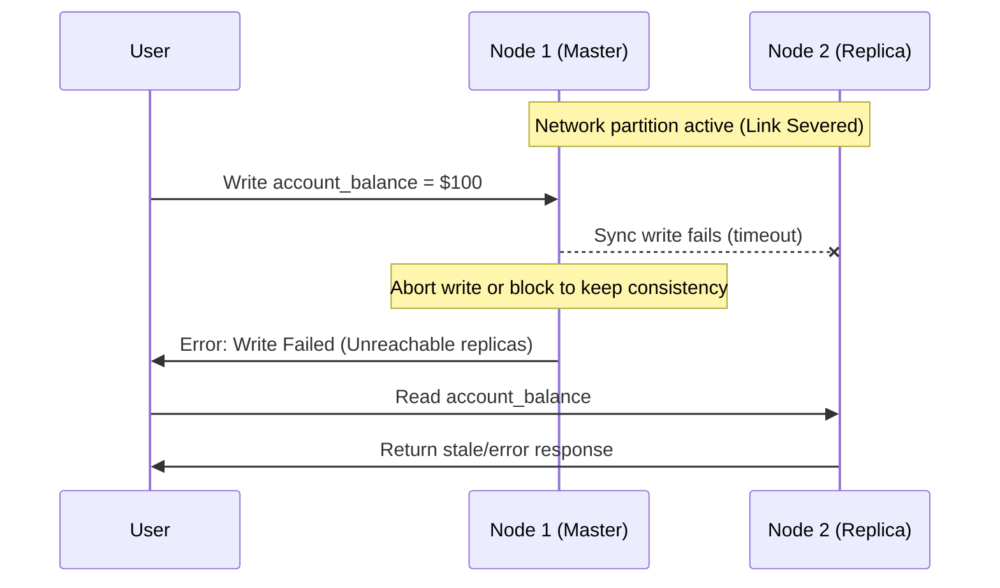
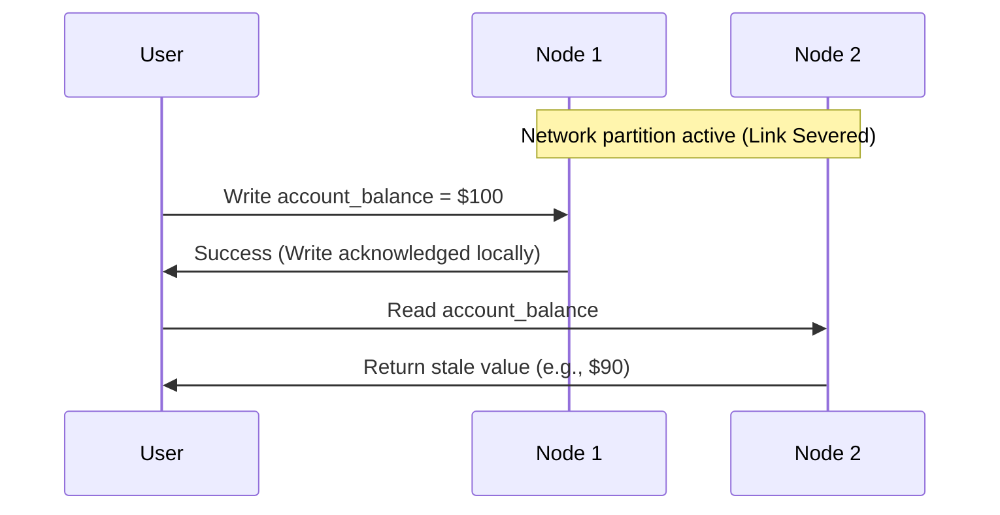

# 🌐 Distributed Systems: The CAP Theorem & PACELC

This module covers consistency-availability trade-offs, network partitioning events, and PACELC refinements in distributed data store design.

---

## 1. Quick Revision Box & Memory Tricks

> [!NOTE]
> * **CAP Theorem**: A distributed system can guarantee at most two of: **Consistency (C)**, **Availability (A)**, and **Partition Tolerance (P)** during a network partition.
> * **The Reality**: Network partitions ($P$) are inevitable on the internet. Therefore, we only choose between **CP** (Consistency on partition) and **AP** (Availability on partition).
> * **PACELC Extension**: **P**artition $\rightarrow$ choose **A**vailability or **C**onsistency; **E**lse (no partition) $\rightarrow$ choose **L**atency or **C**onsistency.
> * **Memory Trick**: 
>   * *CP Databases* (e.g. Spanner/HBase): "Errors are better than wrong data."
>   * *AP Databases* (e.g. Cassandra/Dynamo): "Stale data is better than errors."

---

## 2. Intuition & Real-World Application
Imagine a banking system spanning New York and London. If the transatlantic fiber optic line is severed (a network partition), London cannot sync account balances with New York.
* **If CP is chosen**: A London client trying to withdraw money is blocked or receives a `500 Server Error`. The system denies the request to prevent double-spending (Consistency).
* **If AP is chosen**: The client gets their cash immediately, but the system balance becomes out-of-sync. When the network heals, the balances are reconciled asynchronously (Availability).

---

## 3. Execution Flow under Partition Event

Here is the difference between a Consistent (CP) and an Available (AP) partition response:

### Scenario 1: CP Architecture (Consistency Priority)
If the link between nodes is down, writes on Node 1 cause Node 2 to return errors for reads to guarantee consistency.



### Scenario 2: AP Architecture (Availability Priority)
Reads are served from stale nodes immediately, and replication catches up when the network heals.



---

## 4. PACELC Classification Table

The PACELC theorem expands on CAP by considering tradeoffs under normal operation (Else):

| System / Database | CAP Choice | Else Trade-off (Normal operation) | PACELC Classification |
| :--- | :--- | :--- | :--- |
| **DynamoDB / Cassandra** | AP | Latency (L) over Consistency | **PA / EL** |
| **MongoDB** | CP | Consistency (C) over Latency | **PC / EC** |
| **Spanner (Google)** | CP | Consistency (C) over Latency | **PC / EC** |
| **VoltDB** | CP | Consistency (C) over Latency | **PC / EC** |

---

## 5. Mock Implementations of CP vs AP Reads

Here is pseudocode simulating how nodes process read requests during a partition.

### CP Mock Implementation (Java)
```java
public class CPNode {
    private String data;
    private boolean isPartitioned;

    public synchronized String readData() throws Exception {
        // If we cannot contact quorum, throw error to avoid stale reads
        if (isPartitioned) {
            throw new Exception("Error 500: Database Partitioned. Cannot reach consensus.");
        }
        return this.data;
    }
}
```

### AP Mock Implementation (Python)
```python
class APNode:
    def __init__(self):
        self.data = "Initial Value"
        self.is_partitioned = False
        self.version = 1

    def read_data(self):
        # Always serve local data immediately, even if stale
        return {
            "status": "200 OK",
            "data": self.data,
            "version": self.version,
            "warning": "May contain stale read due to partition" if self.is_partitioned else None
        }
```

---

## 6. Edge Cases & Common Mistakes

* **Mistake**: Designing systems as "purely" CP or AP. Many systems allow configurations (e.g. Cassandra's Consistency Level `QUORUM` vs `LOCAL_ONE` lets you choose CP or AP behavior on a per-query basis).
* **Quorum Calculations**: To guarantee consistency during partition, read and write quorums must satisfy: $R + W > N$ where $N$ is total replicas. If $R + W \leq N$, you invite stale reads (AP).

---

## 7. Curated Design Questions
1. **Scenario**: Design a distributed key-value store for storing temporary shopping carts. What PACELC tradeoffs should you choose? (Recommended: PA/EL - Available during partitions, optimized for speed/latency when healthy).
2. **Company Tags**: Amazon (Dynamo paper context), Netflix (Cassandra clusters), Uber (Ringpop architecture).
