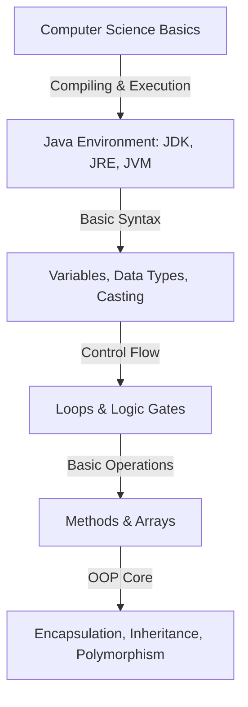
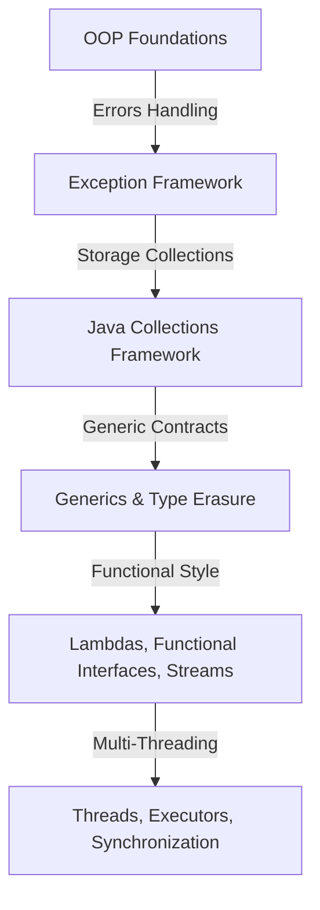
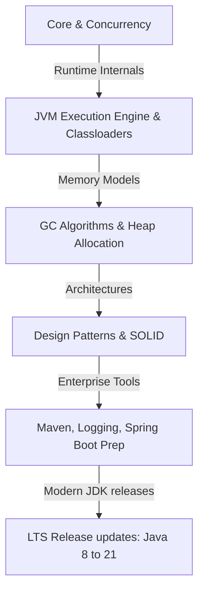

# 🗺️ Java Master Roadmap

Follow this syllabus roadmap to learn Java systematically based on your experience level.

---

## 🚀 1. Phase 1: The Novice Track (Syntax & OOP Foundations)

### Syllabus Chapters:
1. **[Chapter 01: Introduction to Programming](file:///Users/bharathkumar/Desktop/PlacementAI-main/java-handbook/chapters/01_intro_to_programming.md)**
2. **[Chapter 02-03: Java Architectural Motivations](file:///Users/bharathkumar/Desktop/PlacementAI-main/java-handbook/chapters/02_history_of_java.md)**
3. **[Chapter 11-13: Installation & Basic Setup](file:///Users/bharathkumar/Desktop/PlacementAI-main/java-handbook/chapters/11_installation.md)**
4. **[Chapter 14-20: Variables, Expressions, and Loops](file:///Users/bharathkumar/Desktop/PlacementAI-main/java-handbook/chapters/14_variables.md)**
5. **[Chapter 21-24: Data Structures: Arrays & String Pools](file:///Users/bharathkumar/Desktop/PlacementAI-main/java-handbook/chapters/21_arrays.md)**
6. **[Chapter 25-34: Object Oriented Programming Core](file:///Users/bharathkumar/Desktop/PlacementAI-main/java-handbook/chapters/25_oop.md)**

---

## 📈 2. Phase 2: The Professional Track (Core Libraries & Concurrency)

### Syllabus Chapters:
1. **[Chapter 35: Exception Handling & Stack Traces](file:///Users/bharathkumar/Desktop/PlacementAI-main/java-handbook/chapters/35_exception_handling.md)**
2. **[Chapter 36: File Handling & NIO.2 Streams](file:///Users/bharathkumar/Desktop/PlacementAI-main/java-handbook/chapters/36_file_handling.md)**
3. **[Chapter 37: Java Collections Framework](file:///Users/bharathkumar/Desktop/PlacementAI-main/java-handbook/chapters/37_collections_framework.md)**
4. **[Chapter 38: Generics & Wildcards](file:///Users/bharathkumar/Desktop/PlacementAI-main/java-handbook/chapters/38_generics.md)**
5. **[Chapter 39-41: Functional Programming & Stream API](file:///Users/bharathkumar/Desktop/PlacementAI-main/java-handbook/chapters/39_lambdas.md)**
6. **[Chapter 42-43: Multithreading & Lock Concurrency](file:///Users/bharathkumar/Desktop/PlacementAI-main/java-handbook/chapters/42_multithreading.md)**

---

## 🎓 3. Phase 3: The System Architect Track (JVM, Tuning, Patterns)

### Syllabus Chapters:
1. **[Chapter 04: JVM Internals & Garbage Collection](file:///Users/bharathkumar/Desktop/PlacementAI-main/java-handbook/chapters/04_jvm_internals.md)**
2. **[Chapter 44-46: Reflection, Annotations, Serialization](file:///Users/bharathkumar/Desktop/PlacementAI-main/java-handbook/chapters/44_reflection.md)**
3. **[Chapter 47-49: Sockets, JDBC, Java Modules](file:///Users/bharathkumar/Desktop/PlacementAI-main/java-handbook/chapters/47_networking.md)**
4. **[Chapter 50-53: Performance Profiling & Garbage Collectors](file:///Users/bharathkumar/Desktop/PlacementAI-main/java-handbook/chapters/50_garbage_collection.md)**
5. **[Chapter 54-57: Gang of Four Patterns, SOLID, and Testing](file:///Users/bharathkumar/Desktop/PlacementAI-main/java-handbook/chapters/54_design_patterns.md)**
6. **[Chapter 58-61: Build & Deploy Architecture Tools](file:///Users/bharathkumar/Desktop/PlacementAI-main/java-handbook/chapters/58_maven.md)**
7. **[Chapter 66-71: Modern LTS Releases (8, 11, 17, 21, and Virtual Threads)](file:///Users/bharathkumar/Desktop/PlacementAI-main/java-handbook/chapters/66_latest_java_features.md)**
