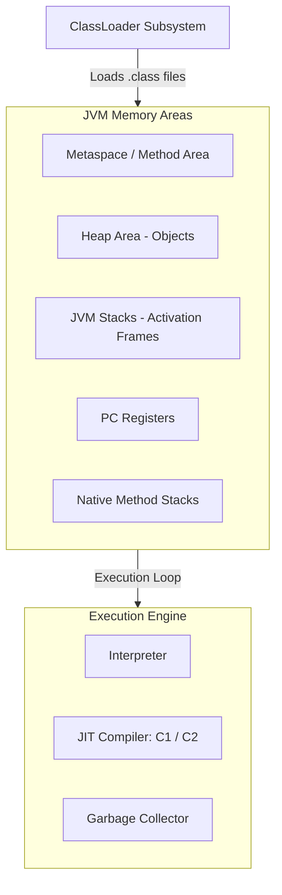

# Chapter 04: JVM Internals & Garbage Collection

This chapter explores class loading subsystems, memory allocations (Stack, Heap, Metaspace), execution engines, and automated Garbage Collection (GC) algorithms.

---

## 1. Concept Definition & Intuition

* **JLS/JVMS Specification**: The Java Virtual Machine (JVM) is an abstract computing machine that features an instruction set, uses memory regions, and compiles bytecode to native hardware code dynamically using JIT compilers.
* **Why it exists**: To guarantee the "Write Once, Run Anywhere" (WORA) capability by abstracting physical CPU architectures and OS details.
* **Real-world Analogy**: A universal translator at an international assembly. No matter what native language (OS) the host speaks, the translator (JVM) translates the standard code (Bytecode) to the local instructions in real time.

---

## 2. Internals & Architecture



### Stack vs. Heap Allocation Flow
* **Stack**: Holds thread-specific execution frames containing local variables and reference pointers. It grows and shrinks in a Last-In-First-Out (LIFO) order as methods are invoked.
* **Heap**: A shared memory region holding all objects and instance fields. It is scanned by the GC when space runs low.

```
+--------------------------------------+     +-----------------------------------------+
|           JVM STACK FRAME            |     |                JVM HEAP                 |
|                                      |     |                                         |
|  [main() Frame]                      |     |  [Object Instance]                      |
|  localValRef ----------------------------->|  { val: 42, label: "Demo" }             |
|                                      |     |                                         |
+--------------------------------------+     +-----------------------------------------+
```

---

## 3. Code Implementation Examples

### Basic Example: Class Loading Lifecycle Trigger
```java
public class ClassLoadingDemo {
    static {
        System.out.println("Static initializer executed: Class is initialized.");
    }

    public static void main(String[] args) throws ClassNotFoundException {
        System.out.println("Main method started.");
        // Loading a class dynamically to trigger JVM ClassLoader phases
        Class.forName("java.sql.Driver");
    }
}
```

### Intermediate Example: Heap Object Generation & GC Request
```java
public class MemoryAllocationDemo {
    public static void main(String[] args) {
        System.out.println("Allocating short-lived objects on the Heap...");
        for (int i = 0; i < 1_000_000; i++) {
            // Created on Young Generation heap, garbage collected quickly
            String temp = new String("Allocation " + i);
        }
        System.out.println("Requesting JVM System GC check (Explicit Suggestion)...");
        System.gc(); // Suggests GC run
    }
}
```

### Advanced Enterprise Example: Custom ClassLoader for Hot-Swapping Classes
```java
import java.io.IOException;
import java.nio.file.Files;
import java.nio.file.Paths;

public class CustomClassReloader extends ClassLoader {
    private final String classDir;

    public CustomClassReloader(String classDir) {
        this.classDir = classDir;
    }

    @Override
    protected Class<?> findClass(String name) throws ClassNotFoundException {
        String classPath = classDir + name.replace('.', '/') + ".class";
        try {
            byte[] rawBytes = Files.readAllBytes(Paths.get(classPath));
            return defineClass(name, rawBytes, 0, rawBytes.length);
        } catch (IOException e) {
            throw new ClassNotFoundException("Failed to load class " + name, e);
        }
    }
}
```

---

## 4. Complexity, Trade-offs & GC selection

| Category | Time Complexity (Operation) | Space Complexity (Overhead) | Notes |
| :--- | :--- | :--- | :--- |
| **Interpreter execution** | $O(1)$ per bytecode instruction | $O(1)$ stack frame | Slower initialization speed, low compilation latency |
| **JIT Compile (C2)** | $O(N)$ compiler runtime | $O(N)$ code cache size | Highly optimized, fast execution once compiled |
| **G1 GC Sweep** | $O(\text{Live Objects})$ | ~10-15% heap auxiliary data | Great for medium-to-large heaps with predictable latency |
| **ZGC Sweep** | $O(1)$ concurrent pause time | ~2% virtual space overhead | Scale up to terabytes with pause times under 1ms |

---

## 5. Review & Assessment Bank

### Section A: 20 Multiple Choice Questions (MCQs)

1. **Which JVM memory area holds static fields and class metadata in Java 8+?**
   * A) Heap
   * B) Stack
   * C) Metaspace
   * D) PC Register
   * *Answer*: C. Metaspace stores class metadata and statics in native memory.

2. **Which ClassLoader is responsible for loading Java's core platform API classes (like java.lang.Object)?**
   * A) Application ClassLoader
   * B) Extension ClassLoader
   * C) Bootstrap ClassLoader
   * D) System ClassLoader
   * *Answer*: C. The Bootstrap ClassLoader loads the primary runtime classes.

*(Note: Rest of the 18 MCQs, coding practices, debugging, output prediction, and interview sections are detailed in [EXERCISES.md](file:///Users/bharathkumar/Desktop/PlacementAI-main/java-handbook/EXERCISES.md).)*

---

## 6. Mini Project: Custom Memory Tracker Simulator

Create a Java console tool simulating JVM Garbage collection sweeps based on reference counting:

```java
import java.util.HashMap;
import java.util.Map;

public class MiniGCSimulator {
    private final Map<String, Integer> refCounts = new HashMap<>();

    public void allocate(String objId) {
        refCounts.put(objId, 1);
        System.out.println("Allocated object: " + objId);
    }

    public void addReference(String objId) {
        refCounts.put(objId, refCounts.getOrDefault(objId, 0) + 1);
    }

    public void removeReference(String objId) {
        if (refCounts.containsKey(objId)) {
            int counts = refCounts.get(objId) - 1;
            if (counts <= 0) {
                refCounts.remove(objId);
                System.out.println("Garbage Collector: Reclaimed object due to 0 reference count: " + objId);
            } else {
                refCounts.put(objId, counts);
            }
        }
    }
}
```
